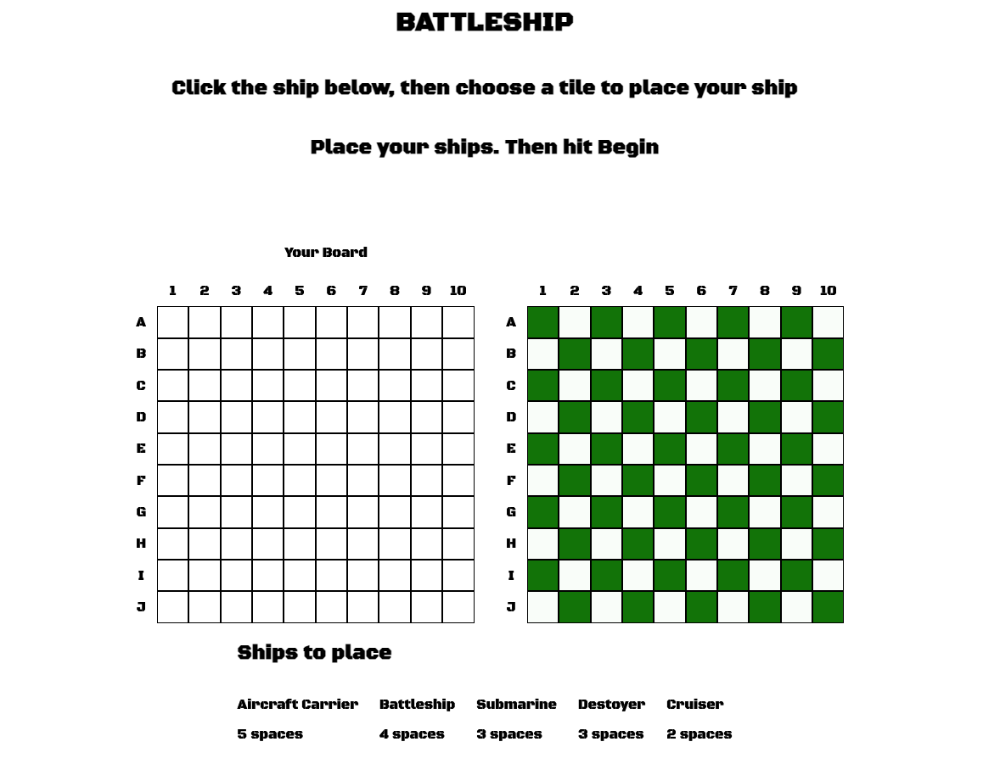
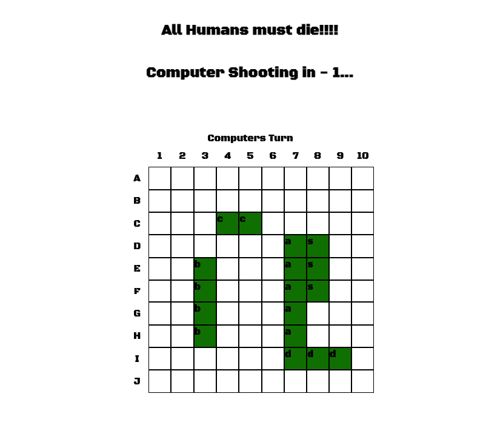

# BattleShip

Overall, this game provides the functionality to play a Battleship game where players can place their ships on the board and take turns to sink the opponent's ships. Implemented code to manage the game state, ship placements, and hit confirmation.

# Screenshots

# Technologies Used

-   JavaScript
-   HTML
-   CSS

# Getting Started

-   View Source [Code Base](https://github.com/Addair89/Battleship/tree/main)
-   View [live](https://addair89.github.io/Battleship/)

Try to beat the evil AI if you're brave enough

# Next Steps

-   I will be improving the AI, not to much,I dont want the computers to take over the world or anything.
-   Adding images for hits, ships, and misses.
-   Adding music to increase the atmosphere
